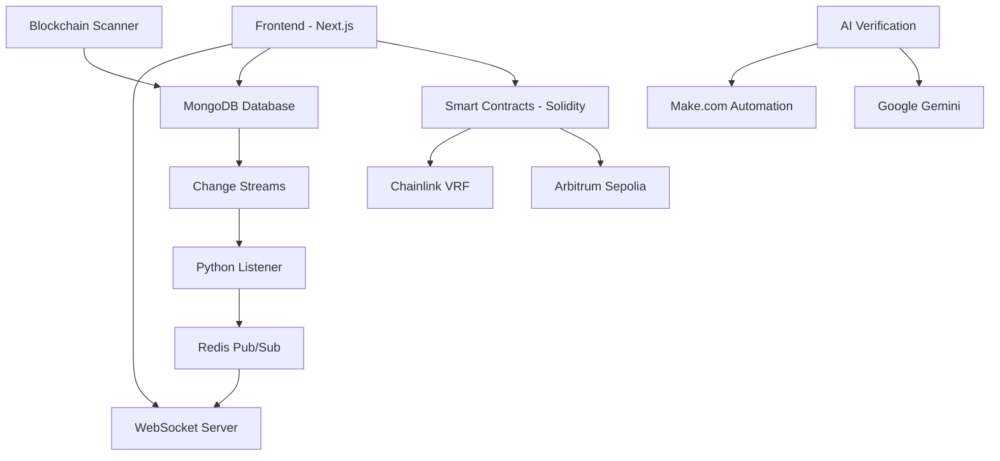

# 🧬 DnA Platform - Decentralized Scientific Content NFT Marketplace

> **Transforming scientific research into verifiable digital assets through blockchain technology**

[](https://platform-dna.vercel.app/)
[](https://opensource.org/licenses/MIT)
[](https://soliditylang.org/)
[](https://nextjs.org/)
[](https://typescriptlang.org/)


## 🌟 Overview

DnA Platform is a revolutionary decentralized marketplace that transforms scientific research into unique, verifiable NFTs. Built on Ethereum (Arbitrum Sepolia), it enables researchers to tokenize their work, ensuring authenticity, traceability, and fair monetization of intellectual property.

### 🎯 Mission
To create an innovative and personalized scientific dissemination experience where researchers can:
- **Tokenize** their scientific articles and content
- **Access exclusive materials** through NFT ownership
- **Participate in thematic seminars** and events
- **Earn royalties** from their intellectual contributions

## ✨ Key Features

### 🔐 **Decentralized Content Registry**
- Authors register content with immutable blockchain records
- Unique hash generation ensures authenticity
- Limited edition NFTs with configurable supply caps

### 🎲 **Verifiable Randomness**
- Chainlink VRF integration for fair NFT metadata generation
- 10% chance of special content variants
- Transparent and auditable randomness

### 💰 **Automated Royalty System**
- 3% automatic royalty distribution to content creators
- 2.5% protocol fees for platform sustainability
- Transparent fee structure

### 🏛️ **Multi-Tier Marketplace**
- **Fixed Price Sales**: Direct NFT purchases
- **English Auctions**: Competitive bidding system
- **Dutch Auctions**: Declining price mechanism *(optional)*

### 🤖 **AI-Powered Author Verification**
- Google Gemini AI evaluates author credentials
- 95% reduction in approval times (48 hours → 30 seconds)
- Automated blockchain whitelisting for qualified authors

### ⚡ **Real-Time Event Monitoring**
- MongoDB Change Streams for instant updates
- Redis Pub/Sub for ultra-fast notifications
- WebSocket integration for live user feedback

## 🏗️ Architecture



## 📜 Smart Contracts

### Core Contracts

#### 1. **ScientificContentRegistry.sol**
- Manages content registration and author whitelisting
- Implements role-based access control (RBAC)
- Tracks content availability and minting limits

```solidity
function registerContent(
    string memory title,
    string memory description,
    uint256 maxCopies,
    string memory _ipfsHash,
    uint256 _nftMintPrice
) external onlyWhitelistedAuthor returns (uint256)
```

#### 2. **ScientificContentNFT.sol**
- ERC-721 compliant NFT implementation
- Integrates with Chainlink VRF for metadata randomization
- Handles minting logic and royalty distribution

#### 3. **DnAContentMarketplace.sol**
- Fixed price sales and auction mechanisms
- Automated fee distribution
- Secure escrow system for auctions

#### 4. **MockVRFCoordinatorV2.sol**
- Local VRF simulation for testing
- Enables development without external dependencies

## 🛠️ Technology Stack

### **Frontend**
```json
{
  "framework": "Next.js 14.2.5",
  "language": "TypeScript 5.0",
  "styling": "Tailwind CSS 3.4.1",
  "web3": "@rainbow-me/rainbowkit 2.2.8",
  "blockchain": "viem 2.31.3, wagmi 2.15.4",
  "ui": "@nextui-org/react 2.6.11"
}
```

### **Backend & Infrastructure**
```json
{
  "database": "MongoDB Atlas",
  "cache": "Redis (Upstash)",
  "automation": "Make.com",
  "ai": "Google Gemini API",
  "containerization": "Docker",
  "deployment": "Fly.io, Vercel"
}
```

### **Blockchain**
```json
{
  "language": "Solidity ^0.8.20",
  "framework": "Hardhat",
  "network": "Arbitrum Sepolia",
  "libraries": "@openzeppelin/contracts",
  "oracles": "Chainlink VRF v2"
}
```

## 🚀 Installation & Setup

### Prerequisites
- Node.js 18+ and npm/yarn
- MetaMask wallet
- Git

### 1. Clone the Repository
```bash
git clone https://github.com/yourusername/dna-platform.git
cd dna-platform
```

### 2. Install Dependencies
```bash
# Frontend dependencies
cd frontend-dapp
npm install

# Smart contract dependencies
cd ../contracts
npm install
```

### 3. Environment Setup
Create `.env.local` in the frontend directory:
```bash
# Blockchain Configuration
NEXT_PUBLIC_CHAIN_ID=421614
NEXT_PUBLIC_RPC_URL=https://sepolia-rollup.arbitrum.io/rpc

# Database
MONGODB_URI=mongodb+srv://your-connection-string

# External APIs
GOOGLE_GEMINI_API_KEY=your-gemini-key
MAKE_WEBHOOK_URL=your-make-webhook-url

# WebSocket & Redis
REDIS_URL=your-redis-url
WEBSOCKET_SERVER_URL=ws://localhost:3001
```

### 4. Deploy Smart Contracts
```bash
cd contracts
npx hardhat compile
npx hardhat deploy --network arbitrumSepolia
```

### 5. Start Development Server
```bash
cd frontend-dapp
npm run dev
```

Visit `http://localhost:3000` to access the application.

## 🧪 Testing

The platform includes comprehensive test coverage with 80+ passing tests:

```bash
cd contracts
npx hardhat test
```

### Test Categories
- **Smart Contract Functionality**: Core NFT and marketplace operations
- **Access Control**: Role-based permissions and security
- **VRF Integration**: Randomness generation and metadata assignment
- **Fee Management**: Royalty and protocol fee distribution
- **Edge Cases**: Error handling and boundary conditions

### Sample Test Results
```
✔ Should deploy all contracts with Mock VRF (88ms)
✔ Should complete the NFT minting process with VRF and correct metadata URI
✔ Should allow users to list and purchase NFTs
✔ Should handle auction lifecycle correctly
✔ Should distribute royalties to authors (3%)
✔ Should collect protocol fees (2.5%)
```

## 🤖 AI-Powered Author Verification

### Automated Verification Pipeline

1. **Application Submission**: Authors submit credentials via web form
2. **AI Evaluation**: Google Gemini analyzes academic background
3. **Smart Scoring**: Three-tier approval system:
   - **Score ≥ 80**: Automatic approval and blockchain whitelisting
   - **Score 60-79**: Manual review required
   - **Score < 60**: Automatic rejection with feedback

### Benefits
- **95% faster approvals**: 30 seconds vs 48 hours
- **Consistent evaluation**: Objective AI-driven criteria
- **Scalable processing**: Handles unlimited concurrent applications
- **Secure integration**: Encrypted private key management for blockchain interactions

## ⚡ Real-Time Event Monitoring

### Dual-Track Architecture

#### Track 1: Immediate User Feedback
```
User Action → MongoDB → Change Streams → Python Listener → Redis → WebSocket → Frontend Update
```

#### Track 2: Blockchain Completeness
```
Blockchain Events → Python Scanner → MongoDB → (Joins Track 1) → Real-time Updates
```

### Technology Stack
- **MongoDB Change Streams**: Instant database notifications
- **Redis Pub/Sub**: Ultra-fast message brokering
- **WebSocket**: Real-time browser communication
- **Python Services**: Event processing and blockchain monitoring

## 👥 User Roles & Permissions

### 🔑 **Standard User**
- Browse registered content and marketplace
- Mint NFTs from available content
- Participate in auctions and fixed-price sales
- View transaction history and owned NFTs

### ✍️ **Author** (Whitelisted)
- All Standard User permissions
- Register new scientific content
- Set pricing and supply limits
- Earn 3% royalties from NFT sales

### 🛡️ **Administrator**
- All Author permissions
- Manage author whitelist
- Create content templates
- Withdraw protocol fees
- Grant/revoke admin roles

## 🚢 Deployment

### Frontend (Vercel)
The frontend is deployed on Vercel with automatic deployments from the main branch.

**Live URL**: [https://platform-dna.vercel.app/](https://platform-dna.vercel.app/)

### Backend Services (Fly.io)
- Python event listeners containerized with Docker
- Redis and MongoDB hosted on managed services
- WebSocket server for real-time communications

### Smart Contracts (Arbitrum Sepolia)
Contracts are deployed and verified on Arbitrum Sepolia testnet for cost-effective testing and development.


## 📄 License

This project is licensed under the MIT License - see the [LICENSE](LICENSE) file for details.

## 🙋‍♂️ Support & Contact

For questions, suggestions, or support:

- **GitHub Issues**: [Report bugs or request features](https://github.com/yourusername/dna-platform/issues)
- **Documentation**: Comprehensive docs available in `/docs` directory
- **Community**: Join our Discord server for discussions

---

<div align="center">

**Built with ❤️ for the scientific community**

*Transforming research into digital assets, one NFT at a time*

</div>